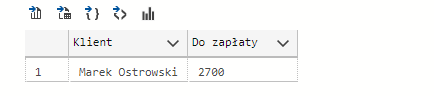
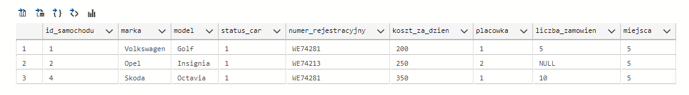
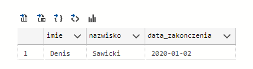
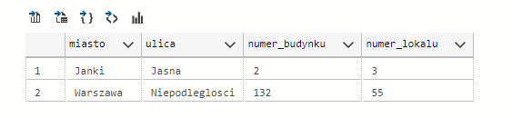

# First Database university project

Simple relational database for car rental company to monitor customers, rentals, payments and locations.

## Usage

- Step 1. Clone/Download this repository
- Step 2. [Install `Microsoft SQL Server`](https://www.microsoft.com/pl-pl/sql-server/sql-server-downloads)
- Step 3. [Install `Azure Data Studio` on Windows/Linux/macOS ](https://docs.microsoft.com/pl-pl/sql/azure-data-studio/download-azure-data-studio?view=sql-server-ver16)
- Step 4. Create connection to your SQL Server.
- Step 5. Run notebook `Database_and_queries.ipynb` from Azure Data Studio

## Sample Queries
### 1. Calculate customer arrears 
```sql
USE Wypozyczalnia
SELECT
   CONCAT_WS(' ', k.Imie, k.Nazwisko) AS 'Klient', 
   SUM(p.kwota) AS 'Do zapłaty' 
FROM 
    Platnosc AS p
    JOIN
    Zamowienie AS z ON p.id_platnosci = z.id_platnosci AND p.status_platnosci = 0
    JOIN
    Klient  AS k ON k.id_klienta = z.id_klienta
     
GROUP BY k.Imie , k.Nazwisko;
```
`Output`:


### 2. Show available cars in order of the cheapest
```sql
USE Wypozyczalnia
SELECT *
FROM Samochod 
WHERE status_car <> 0 
ORDER BY koszt_za_dzien
```
`Output`:


### 3. Searching for Employee and date of termination of the contract of employees who have finished their work

```sql
SELECT K.imie, K.nazwisko
FROM Klient K
INNER JOIN Zamowienie Z ON Z.id_klienta = K.id_klienta
WHERE id_zamowienia = '2'
```
`Output`:

### 4. Searching for the addresses of the locations where you can rent a car

```sql
SELECT DISTINCT A.miasto, A.ulica, A.numer_budynku, A.numer_lokalu
FROM Dane_adresowe A
INNER JOIN Samochod S ON S.placowka = A.id_adres
```
`Output`:

